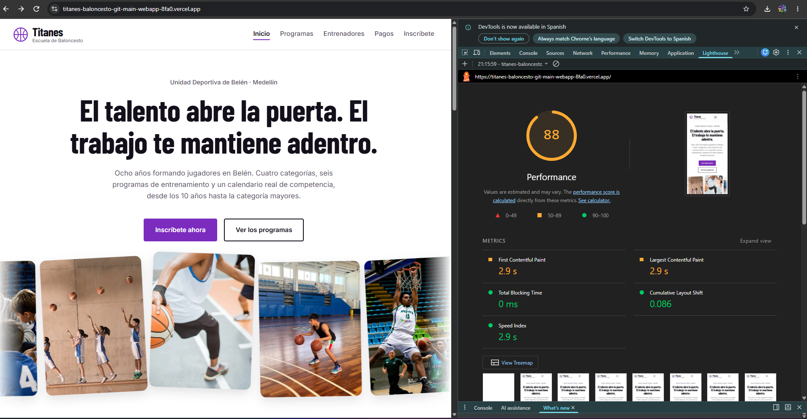
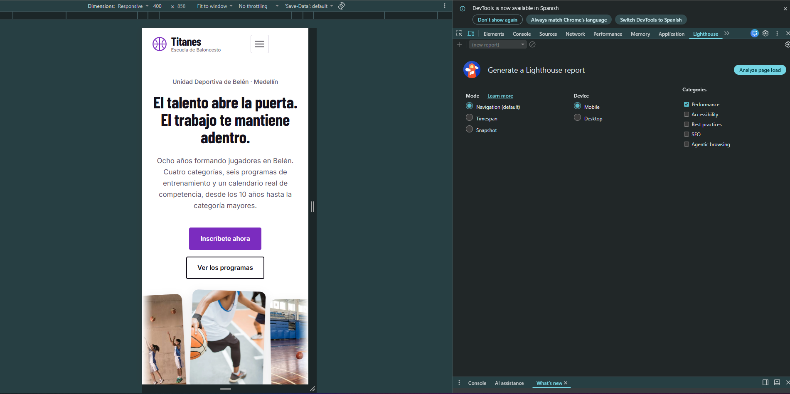

# Titanes — Escuela de Baloncesto

Sitio web de Titanes, una escuela de baloncesto ubicada en la Unidad
Deportiva de Belén, en Medellín. La escuela está dividida en cuatro
categorías —formativa, competitiva, elite y mayores— y cada programa
lo dirige uno de los cuatro entrenadores, que enseñan según su
especialidad para que todos los programas mejoren.

El sitio resuelve un problema concreto: alguien que quiere entrar a
la escuela necesita saber qué programa le corresponde según su edad,
en qué horario entrena, cuánto cuesta y si todavía hay cupos. Antes
eso tocaba preguntarlo por teléfono.

**Sitio publicado:** https://titanes-baloncesto.vercel.app/

## El dominio

El proyecto tiene dos entidades relacionadas entre sí:

- **Programas** — los seis grupos de entrenamiento. Cada uno tiene
  categoría, rango de edad, días, horario, precio, cupos y descripción.
- **Entrenadores** — los cuatro entrenadores, con su especialidad,
  años de experiencia y biografía.

La relación vive en el campo `entrenadorId` de cada programa, que
apunta al `id` de un entrenador. Funciona igual que una llave foránea:
cuando se dibuja una tarjeta, se busca el entrenador por ese id y se
muestra su nombre.

Los seis programas están en un arreglo de objetos dentro de
`js/main.js`. En la Entrega 2 ese arreglo se reemplaza por los datos
que devuelva la API, y el resto del código no tiene que cambiar.

## Capturas

### Escritorio


### Móvil


## Estructura del proyecto
```
titanes-baloncesto/
├── index.html Inicio: hero, categorías, torneos y pagos
├── grupos.html Catálogo de programas con filtro
├── entrenadores.html Los cuatro entrenadores
├── inscripcion.html Formulario de inscripción
├── css/styles.css Estilos de todo el sitio
├── js/main.js Datos y lógica de la interfaz
└── img/ Imágenes

```


Usé **un solo archivo CSS y un solo JavaScript** para las cuatro
páginas, no uno por página. La razón es que las cuatro comparten
cabecera, menú, pie y botones: eso es más de la mitad del código.
Si lo separara por página tendría que copiar ese código cuatro veces
y, el día que cambie el color de la cabecera, acordarme de cambiarlo
en cuatro sitios. Además el navegador descarga el CSS una sola vez y
lo reutiliza al navegar entre páginas.

## Decisiones técnicas

### Dónde usé Flexbox y dónde Grid

Usé **Flexbox** donde el contenido va en una sola dirección:

- La cabecera, con `justify-content: space-between` para empujar el
  logo a un extremo y el menú al otro.
- Los botones del hero, los filtros del catálogo y el pie de cada
  tarjeta, que son filas que se acomodan solas.

Usé **Grid** donde hay filas y columnas que deben alinearse entre sí:

- El catálogo de programas.
- Las cuatro categorías, las cifras, los torneos y la tabla de pagos.
- El formulario junto a su columna lateral.

La línea más importante es la del catálogo:

```css
grid-template-columns: repeat(auto-fit, minmax(17rem, 1fr));
```

Le dice al navegador que haga tantas columnas como quepan, de mínimo
17rem cada una. En un celular cabe una columna, en tablet dos y en
escritorio tres o cuatro, **sin escribir una sola media query para
eso**. Es lo que hace que el catálogo cambie de columnas según el ancho.

### Variables de CSS

Todos los colores, espaciados y tipografías están declarados como
variables en `:root`. Eso me permitió cambiar toda la paleta del sitio
editando siete líneas cuando decidí pasar de azul a morado. También
uso una variable por categoría (`--cat-formativa`, `--cat-elite`, etc.)
para que cada categoría tenga su color en el filtro, en el borde
superior de su tarjeta y en el panel informativo.

### Responsive

Trabajé con enfoque **mobile first**: los estilos base son la versión
de celular y las media queries usan `min-width` para ir ampliando el
diseño en 640px y en 1024px. Lo hice así porque agregar es más limpio
que quitar: si empiezas por escritorio y vas achicando, terminas
reescribiendo muchas más reglas.

En móvil el menú se colapsa en un botón hamburguesa; a partir de
1024px ese botón desaparece y el menú vuelve a ser una fila.

### Qué hace mi JavaScript

Son cuatro interacciones:

**1. Menú responsive.** El botón hamburguesa abre y cierra el menú.
El estado no lo guardo en una variable aparte, sino en el atributo
`aria-expanded` del botón: así el estado visual y el que lee un
lector de pantalla nunca se desincronizan. El CSS se engancha a ese
mismo atributo para convertir las tres líneas en una X. También se
cierra con la tecla Escape.

**2. Catálogo generado dinámicamente.** Las seis tarjetas no están
escritas en el HTML: el archivo `grupos.html` solo tiene un `div`
vacío. El JavaScript recorre el arreglo de programas, crea cada
tarjeta con `createElement` y la inserta. Para el texto uso
`textContent` y no `innerHTML`, así nunca se interpreta HTML que
venga de los datos.

**3. Filtro por categoría.** Los botones de filtro vuelven a dibujar
el catálogo mostrando solo los programas de esa categoría, y además
despliegan un panel con qué se trabaja en esa etapa y en qué torneos
compite. Uso **delegación de eventos**: en vez de poner un listener
en cada botón, pongo uno solo en el contenedor y averiguo cuál se
pulsó con `event.target`. Funciona porque los eventos burbujean desde
el botón hasta el contenedor.

**4. Validación del formulario**, explicada abajo.

### Cómo funciona la validación

El formulario lleva el atributo `novalidate`, que apaga los mensajes
automáticos del navegador. Así toda la validación es la mía y los
errores aparecen **debajo de cada campo**, nunca en un alert.

Al enviar, `preventDefault()` detiene el envío mientras se revisan
los datos. Si algo falla, el campo se marca con borde rojo, su
mensaje aparece debajo y el foco salta al primer error, para que
alguien que navegue con teclado sepa dónde corregir.

Las validaciones generales son: nombre requerido de mínimo 5
caracteres, correo con formato válido comprobado con una expresión
regular, teléfono de exactamente 10 dígitos, edad entre 10 y 60, y
las casillas obligatorias.

Pero lo que le da sentido al formulario son **tres reglas propias de
mi dominio**:

1. **Bloque de acudiente condicional.** Si la edad escrita es menor
   de 18, aparece un bloque pidiendo el nombre, el teléfono y la
   autorización del acudiente. Esos tres campos solo se validan
   cuando el bloque está visible. Si la edad es 18 o más, el bloque
   desaparece y deja de exigirse.

2. **Un programa sin cupos no admite inscripción.** En el catálogo la
   tarjeta aparece atenuada y con el botón deshabilitado; en el
   formulario esa opción del select aparece pero no se puede elegir.
   Usé un `button` deshabilitado en vez de un enlace, porque un enlace
   no se puede desactivar de verdad.

3. **La edad debe corresponder al programa.** Cada programa tiene
   `edadMin` y `edadMax`. Si alguien de 25 años selecciona Formativa
   Mañana, el formulario avisa que ese programa es para jugadores de
   10 a 12 años.

### Accesibilidad

- Enlace de "saltar al contenido" como primer elemento enfocable.
- Todos los campos con su `<label for="...">` asociado, y los
  mensajes de error conectados con `aria-describedby`.
- `aria-current="page"` marcando en qué página estás.
- Foco visible en todo elemento interactivo.
- Los cambios del filtro y el mensaje de éxito se anuncian con
  `aria-live="polite"`.
- `@media (prefers-reduced-motion: reduce)` apaga todas las
  animaciones para quien lo tenga configurado.

### Uso de IA

>para que te explicara cómo funciona el DOM,
> para resolver el problema del `.gitignore`, para revisar el (CSS),
> y qué decidiste tú: el tema del proyecto, las categorías, los
> horarios, los precios, los nombres, la regla de los cupos, la de
> la edad por programa, los colores y en organizar el readme en palabras mas estrucuturadas y que fuera mas tecnico.

### Lo más difícil

Las imágenes no aparecían en el sitio publicado. La carpeta img había quedado dentro de js, y dos archivos tenían la extensión equivocada (.jpeg y .webp cuando el HTML pedía .jpg). En local podía no notarse; en Vercel se vio de una
## Próximos pasos (Entrega 2)

- Reemplazar el arreglo de objetos de `js/main.js` por llamadas a la
  API. La estructura de los datos ya está pensada para eso: cada
  programa tiene su `id` y su `entrenadorId`.
- Gestión real de cupos: que al inscribirse se descuente un cupo de
  la base de datos en lugar de estar fijo en el arreglo.
- Portal de pagos con consulta por documento, calendario de cuotas y
  registro de los pagos realizados.
- Selección de número de camiseta, validando que no se repita dentro
  de la misma categoría.